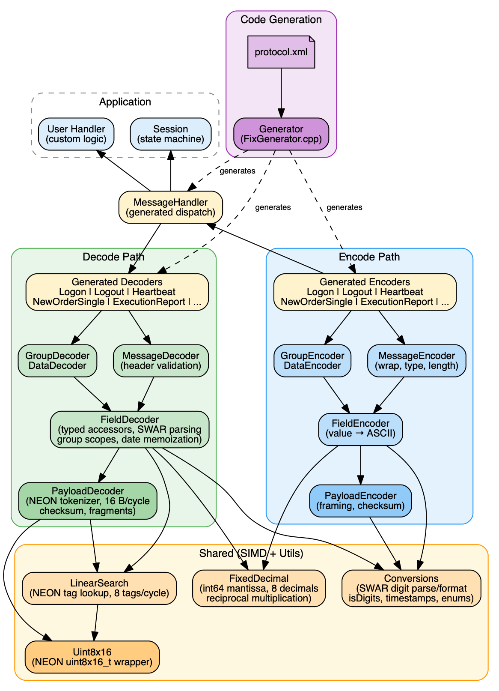

# simdfix

A SIMD-accelerated [FIX](https://www.fixtrading.org/standards/fix-sessions-online/) (Financial Information Exchange) protocol codec in C++23, targeting ARM NEON. Decodes and encodes FIX messages using 16-byte parallel NEON operations and SWAR (SIMD Within A Register) digit parsing with zero copies.

## Features

- **Header-only library** — add it as a CMake `INTERFACE` dependency (`Session.cpp` is the only compiled translation unit).
- **SIMD tokenization** — processes 16 bytes per cycle to detect tag delimiters (`=`) and field separators (`0x01`).
- **Zero-copy parsing** — the decoder produces a flat `Field[]` array of positions, tags, and lengths without copying message data.
- **Encode and decode** — typed field, group, and data (raw binary) accessors for both reading and writing FIX messages.
- **Code generation** — message decoders, encoders, and handler dispatch are generated from `protocol.xml` via the included `Generator` tool.
- **No exceptions in the hot path** — fallible operations return `std::expected<T, Result>`.

## Requirements

- C++23 compiler (Clang 16+ or GCC 13+)
- CMake 3.20+
- ARM (NEON) target
- [Google Test](https://github.com/google/googletest) (for tests)
- [pugixml](https://pugixml.org/) (for the code generator)

## Building

```bash
# Debug build (includes AddressSanitizer + coverage)
cmake -B cmake-build-debug -DCMAKE_BUILD_TYPE=Debug
cmake --build cmake-build-debug

# Release build (O3, LTO, march=native)
cmake -B cmake-build-release -DCMAKE_BUILD_TYPE=Release
cmake --build cmake-build-release

# Build a single target
cmake --build cmake-build-debug --target PayloadDecoderTest
```

## Running Tests

```bash
# Run all tests via CTest
cd cmake-build-debug && ctest --output-on-failure

# Run a single test binary
./cmake-build-debug/MessageDecoderTest

# Filter to specific tests
./cmake-build-debug/MessageDecoderTest --gtest_filter="MessageDecoder.Logon"
./cmake-build-debug/PayloadDecoderTest --gtest_filter="PayloadDecoder.TrailerSplitCheckSum"
./cmake-build-debug/FieldDecoderTest --gtest_filter="FieldDecoder.GetFixedDecimal"
```

## Benchmarks

Always use a Release build — Debug builds include AddressSanitizer and coverage overhead that skews numbers.

```bash
./cmake-build-release/SimdFixBenchmark            # run all benchmarks
./cmake-build-release/SimdFixBenchmark logon-hot   # run a specific benchmark
```

Available benchmarks: `logon-cold`, `logon-hot`, `logon-getters`, `logon-groups`, `logon-data`, `logon-encode`, `nos-hot`, `nos-getters`, `nos-encode`, `er-hot`, `er-getters`, `er-encode`, or `all` (default).

### Results (Apple M4, Release build)

| Benchmark | Message Size | Throughput | Latency |
|-----------|-------------|-----------|---------|
| Logon decode | 142 B | 1.54 GB/s | 92 ns/msg |
| Logon getters | 142 B | 1.21 GB/s | 118 ns/msg |
| Logon encode | 142 B | 2.19 GB/s | 103 ns/msg |
| NewOrderSingle decode | 154 B | 1.62 GB/s | 95 ns/msg |
| NewOrderSingle getters | 154 B | 1.02 GB/s | 151 ns/msg |
| NewOrderSingle encode | 154 B | 4.34 GB/s | 38 ns/msg |
| ExecutionReport decode | 245 B | 1.68 GB/s | 146 ns/msg |
| ExecutionReport getters | 245 B | 1.04 GB/s | 236 ns/msg |
| ExecutionReport encode | 245 B | 2.42 GB/s | 101 ns/msg |

## Code Coverage

```bash
cmake --build cmake-build-debug --target Coverage
```

This runs all test binaries, merges their `profraw` files, and prints an `llvm-cov` summary report.

## Code Generation

Message types (decoders, encoders, handler dispatch) are generated from `src/generator/resources/protocol.xml`. To regenerate after changing the protocol spec:

```bash
cmake --build cmake-build-debug --target GenerateMessages
```

Do not hand-edit files under `src/main/cpp/org/limitless/fix/messages/` — they are overwritten by the generator.

## Architecture



### Decode Data Flow

```
Raw FIX bytes
    → PayloadDecoder::parse()         # SIMD tokenization; fills Field[64] array
    → MessageHandler::handle()        # Dispatch by MsgType tag
    → LogonDecoder / ExecutionReportDecoder / ...  # Typed field access via SIMD LinearSearch
    → Application handler (Session or user code)
```

### Encode Data Flow

```
Application handler
    → LogonEncoder / NewOrderSingleEncoder / ...  # Typed field setters
    → PayloadEncoder::encode()        # Serializes fields into FIX wire format
    → Raw FIX bytes
```

### Key Components

#### Decoding

**`PayloadDecoder.hpp`** — Core tokenization engine. Processes 16 bytes/cycle with NEON to detect `=` (tag end) and `0x01` (field end). Returns a flat `Field[]` array (position + tag + length, no copies) and a `Result` status. Handles fragmented messages and split tags across chunk boundaries. Validates checksum, body length, and begin string.

**`FieldDecoder.hpp`** (`detail/decoder/`) — Field-level access to a decoded message. Provides typed field accessors (`getUint32`, `getInt32`, `getFixedDecimal`, `getTimestamp`, `getEnum`, `getString`) with SWAR-accelerated numeric parsing. Manages repeating-group scope tracking. Memoizes date-to-epoch conversion across fields sharing the same date.

**`MessageDecoder.hpp`** — Base for generated message decoders. Wraps a `FieldDecoder` and extracts/validates standard header fields (SenderCompID, TargetCompID, MsgSeqNum, SendingTime) against an optional `SessionContext`.

**`GroupDecoder.hpp`** — Repeating-group iterator. Scans for group entries by their delimiter tag, pushes/pops `FieldDecoder` scopes so field lookups are restricted to the current group entry.

**`DataDecoder.hpp`** — Handles raw-data (Length+Data tag pair) fields, e.g. XmlData.

#### Encoding

**`PayloadEncoder.hpp`** — Serializes encoded fields into a byte buffer. Writes the begin string, body length, and checksum framing. Uses SWAR for integer-to-ASCII conversion.

**`FieldEncoder.hpp`** (`detail/encoder/`) — Field-level encoding. Converts typed values (integers, decimals, timestamps, enums, strings) to their FIX wire representation.

**`MessageEncoder.hpp`** — Base for generated message encoders. Provides the `wrap`/`encodedLength`/`type` interface that `PayloadEncoder` uses to frame a complete message.

**`GroupEncoder.hpp`** — Encodes repeating groups: manages the group-count tag and per-entry field serialization.

#### Shared

**`Uint8x16.hpp`** (`detail/simd/`) — Thin NEON wrapper (`uint8x16_t`). All SIMD operations go through here. If porting off ARM, this is the only layer to replace.

**`LinearSearch.hpp`** (`detail/simd/`) — NEON-accelerated tag lookup in the `uint16_t` tag array. Processes 8 tags per cycle.

**`Conversions.hpp`** (`utils/`) — SWAR digit parsing (`asciiToUint64`), digit validation (`isDigits`), timestamp parsing/formatting, integer-to-ASCII conversion, enum lookup tables, and `FixedDecimal` encoding/decoding helpers.

**`FixedDecimal.hpp`** (`utils/`) — Fixed-point decimal type (8 implicit decimal places, `int64_t` mantissa). Supports arithmetic via reciprocal multiplication (no hardware division). Used for FIX price/quantity fields.

**`FixTypes.hpp`** (`messages/`) — Generated enum wrappers and type metadata for the protocol's field types (e.g., `OrdType`, `Side`, `ExecType`).

#### Generated Code

**`FixMessageDecoders.hpp`** / **`FixMessageEncoders.hpp`** / **`FixMessageHandler.hpp`** — Generated by `Generator` from `protocol.xml`. Contain per-message-type decoder/encoder structs and the `MessageHandler` dispatch switch. Do not edit manually.

**`Generator` (`FixGenerator.cpp`)** — Reads `protocol.xml` and emits all generated headers. Run after changing the protocol spec.

#### Session

**`Session.hpp`** / **`Session.cpp`** — FIX session state machine (Disconnected → Connecting → Connected → SentLogon → Active). Subclasses `MessageHandler` to handle session-level messages (Logon, Logout, Heartbeat, TestRequest, ResendRequest, SequenceReset, Reject).

### Design Constraints

- **Max 64 fields** per message — compile-time constant in `PayloadDecoder.hpp`.
- **ARM NEON only** — `Uint8x16` wraps `arm_neon.h` intrinsics directly.
- **No exceptions** — errors propagate as `std::expected<T, Result>`. (`std::invalid_argument` thrown from `GroupDecoder::wrap` on a missing tag is a known exception to this rule.)

### Adding a New Message Type

1. Add the message definition to `protocol.xml`.
2. Run `Generator` to regenerate `FixMessageDecoders.hpp`, `FixMessageEncoders.hpp`, `FixMessageHandler.hpp`, and `FixTypes.hpp`.
3. Add a `handle(FooDecoder&)` override in application handler code (e.g., `Session`).

## License

See [LICENSE](LICENSE) for details.
